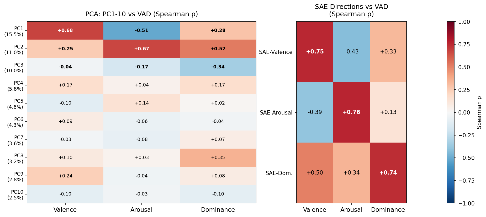

# PCA 与 SAE 对情绪 VAD 三维结构的对齐 — SAE 半监督下提取支配度特征 ρ=0.74，超 PCA 三倍

## 元信息

| 字段 | 内容 |
|---|---|
| 编号 | EMI-004 |
| 日期 | 2026-04-28 |
| 状态 | 完成 |
| 数据版本 | 171 情绪 × 20 叙述，Gemma 2 2B layer 25 残差流，encode-then-mean |
| VAD 词典 | NRC-VAD-Lexicon（Warriner et al., 2013），匹配 156/171 情绪 |
| SAE 权重 | Gemma Scope layer 25, width 16k, avg_l0=55，JumpReLU 激活 |
| 改进自 | EMI-003（3叙述 + mean-then-encode，已归档）|

---

## 背景与目标

### 研究问题

语言模型的残差流（residual stream）是一个高维实值向量空间。人类情绪心理学有一个经典的三维结构——**VAD 框架**（Valence 效价 / Arousal 唤醒度 / Dominance 支配度）——它能解释人类对情绪词语相似度的判断。

本实验的核心问题是：**Gemma 2 2B 的内部激活空间，是否自发地对应于人类情绪的 VAD 三维结构？PCA 和 SAE 哪种方法更能捕捉这个结构？**

### VAD 框架简介

Russell & Mehrabian (1977) 提出，几乎所有情绪都可以用三个维度描述：

| 维度 | 含义 | 示例（高→低）|
|---|---|---|
| **Valence（效价）** | 正面 vs 负面情感 | joyful → terrified |
| **Arousal（唤醒度）** | 激活/兴奋 vs 平静/抑制 | ecstatic → serene |
| **Dominance（支配度）** | 有控制感 vs 被控制 | powerful → helpless |

本实验使用 **NRC-VAD-Lexicon**（Warriner et al., 2013）提供的 171 个情绪词的 VAD 评分作为外部验证标准，评分均为 0–1 连续值。

### 为什么 PCA 可能不够？

PCA（主成分分析）的目标是找**方差最大的方向**，它的逻辑是：模型激活方差大的地方，包含了最多信息。但方差大 ≠ 语义纯净。

语言模型的残差流存在 **superposition（叠加）现象**：多个语义概念以非正交方向叠加在同一个高维空间里，任何单一方向都可能同时混合多个语义。PCA 找到的主成分因此可能是多个概念的混合，而不是某个单义维度（如"支配度"）的纯净方向。

### 为什么 SAE 可能更好？

**稀疏自动编码器（SAE）** 在重建激活的同时，用稀疏性约束（每次前向传播只激活少量特征）迫使每个特征变得更单义。理论上，SAE 能把 superposition 分解为更干净的特征字典，其中每个特征对应一个更具体的概念。

本实验用预训练 SAE（Gemma Scope）的特征空间，通过 VAD 标签半监督地构造三个方向，验证 SAE 特征空间是否比 PCA 方差轴更干净地分离 VAD 三个维度。

---

## 核心变量与操作定义

### 输入数据

**情绪叙述矩阵**（`narrative_matrix.npy`，shape (171, 20, 2304)）：
- 171 个情绪词，每个词用 Qwen3.6-flash 生成 20 条第一人称叙述（如"感到恐惧"的 20 个不同场景描述）
- 每条叙述输入 Gemma 2 2B，取第 25 层残差流所有 token 的注意力 mask 加权均值，得到一个 2304 维向量
- 最终形状：171 个情绪 × 20 条叙述 × 2304 维

**情绪均值向量**（`emotion_matrix.npy`，shape (171, 2304)）：
- 对每个情绪的 20 条叙述激活取均值，得到该情绪的代表向量
- 用于 PCA 分析

**VAD 评分**（NRC-VAD-Lexicon）：
- 每个情绪词有三个 0–1 的连续评分：valence（0=极负，1=极正）、arousal（0=极平静，1=极兴奋）、dominance（0=完全无控制感，1=完全有控制感）
- 171 个情绪中 156 个能在词典中匹配（14 个多词短语无法匹配，1 个未收录）

### PCA 分析

**操作步骤**：
1. 对 emotion_matrix (171, 2304) 做 StandardScaler 标准化（每维度减均值、除标准差），得到标准化矩阵
2. 对标准化矩阵做 PCA，提取 10 个主成分（PC1–PC10）
3. 每个 PC 是一个 2304 维方向向量；把 156 个匹配情绪的均值向量投影到每个 PC 上，得到 156 个标量投影值
4. 用 **Spearman ρ**（秩相关）计算每个 PC 的投影值与该情绪的 VAD 评分之间的相关系数

**为什么用 Spearman 而不是 Pearson**：VAD 评分在 0–1 之间不一定服从正态分布；Spearman 只看排序，对分布形态更稳健。

**读数方式**：PC1 与效价的 Spearman ρ = +0.68，意味着——在 156 个情绪里，PC1 投影值越高的情绪，人类评定的效价越高（越正面）；ρ 越接近 ±1 说明对应越干净。

### SAE 分析

**SAE 结构**（Gemma Scope，JumpReLU）：
- 编码器：W_enc (2304, 16384)，b_enc (16384,)，threshold (16384,)
- 解码器：W_dec (16384, 2304)
- 激活函数：JumpReLU，即 `f(x) = x * (x > threshold)`——只有超过阈值的特征才非零，平均每次前向传播约 55 个特征激活（avg_l0 = 55）

**编码顺序（encode-then-mean，关键）**：

```
正确做法（本实验）：
  对每条叙述分别做 SAE 编码 → 在特征空间取均值
  features_3d = JumpReLU(narrative_matrix @ W_enc + b_enc)  # (171, 20, 16384)
  features    = features_3d.mean(axis=1)                    # (171, 16384)

错误做法（EMI-003）：
  先在激活空间取均值 → 再做 SAE 编码
  mean_act  = narrative_matrix.mean(axis=1)                 # (171, 2304)
  features  = JumpReLU(mean_act @ W_enc + b_enc)            # (171, 16384)
```

为什么顺序重要：JumpReLU 是非线性变换，`mean(JumpReLU(x)) ≠ JumpReLU(mean(x))`。先均值再编码会把叙述间不一致的激活混平，导致超过阈值的特征数量从 ~55 骤降至 13.5，丢失大量稀疏结构。

**VAD 方向构造（半监督）**：
1. 对 156 个匹配情绪，计算每个 SAE 特征 j 的激活值（`features[:, j]`）与 VAD 某一维度（如 valence）评分的 Spearman ρ
2. 取 |ρ| 最大的 top-50 特征，用 ρ 加权其解码器方向 W_dec[j]（2304 维），求和后单位化：
   `direction = normalize(Σ ρⱼ · W_dec[j])`
3. 把 156 个情绪的均值激活投影到这个方向，再算与 VAD 评分的 Spearman ρ

**注意**：SAE 输入用原始激活（不做 StandardScaler），因为 SAE 的 threshold 和权重均在原始激活分布下训练，标准化会破坏 JumpReLU 的稀疏性。

**半监督的含义**：VAD 标签被用于选取特征和加权方向——这证明 SAE 特征空间"能够"与 VAD 对齐，但不能作为模型**自发地**学到了 VAD 结构的证据。

---

## 结果

### 可视化



*左图：PC1–10 各自与效价/唤醒度/支配度的 Spearman ρ（绝对值），颜色越深说明对应越强。右图：SAE 合成的三个方向与三个 VAD 维度的 Spearman ρ，理想情况下对角线应为 1，非对角线为 0。*

---

### 结果一：PCA — PC1 ≈ 效价，PC2 ≈ 唤醒度，支配度无法对齐

| PC | 方差解释率 | 效价 ρ | 唤醒度 ρ | 支配度 ρ | 主要对应 |
|---|---|---|---|---|---|
| **PC1** | 15.5% | **+0.677** | −0.513 | +0.284 | 效价（正/负情感）|
| **PC2** | 11.0% | +0.254 | **+0.665** | +0.522 | 唤醒度（激活程度）|
| PC3 | 10.0% | −0.038 | −0.166 | −0.338 | 无明确对应 |
| PC4–10 | 各 2–6% | 均 < 0.2 | 均 < 0.2 | 均 < 0.35 | 无明确对应 |

PC1–10 累计解释 62.3% 的方差。支配度在所有 10 个 PC 上的最高绝对相关系数仅为 0.35（PC8），且非主导方向。

**PC1 的语义验证**（高端/低端情绪）：
- 高端（投影值最大）：blissful / serene / peaceful / content → 正面情感
- 低端（投影值最小）：scared / afraid / terrified / horrified → 负面情感
- → PC1 就是效价轴，无监督地自发出现

**PC2 的语义验证**：
- 高端：ecstatic / thrilled / jubilant / excited → 高唤醒正面
- 低端：dispirited / weary / listless / sluggish → 低唤醒负面
- → PC2 近似唤醒度轴，但混入了少量效价信息（ρ=+0.25）

**为什么支配度消失了**：支配度信息分散在多个低方差方向的混合中，没有任何单一方向以足够大的方差承载它——这正是 superposition 的表现。PCA 按方差排序，必然先找到效价和唤醒度（方差最大的两个维度），支配度被"遮盖"。

---

### 结果二：SAE 合成方向在三个 VAD 维度上全面优于 PCA

| 方向 | 效价 ρ | 唤醒度 ρ | 支配度 ρ | 目标维度对角值 |
|---|---|---|---|---|
| SAE-Valence | **+0.755** | −0.425 | +0.326 | 0.755 |
| SAE-Arousal | −0.394 | **+0.765** | +0.134 | 0.765 |
| SAE-Dominance | +0.503 | +0.340 | **+0.742** | 0.742 |

**与 PCA 最佳值对比**：

| VAD 维度 | PCA 最佳 ρ | 来自哪个 PC | SAE ρ | 绝对提升 |
|---|---|---|---|---|
| 效价 | 0.677 | PC1 | 0.755 | +0.08 |
| 唤醒度 | 0.665 | PC2 | 0.765 | +0.10 |
| **支配度** | 0.338 | PC8（反向）| **0.742** | **+0.40** |

支配度的提升幅度（+0.40）是效价/唤醒度提升（约 +0.09）的 4 倍以上，说明 SAE 的核心优势在于**捕捉了 PCA 完全看不到的支配度信息**。

每情绪平均激活 SAE 特征数：31.3 ± 5.2（encode-then-mean 修正后；EMI-003 错误做法为 13.5，接近理论值 55 的一半以上）。

---

### 结果三：版本对比——编码顺序和叙述数量的影响

| 指标 | EMI-003（3叙述 + mean-then-encode）| EMI-004（20叙述 + encode-then-mean）| 变化 |
|---|---|---|---|
| 平均激活特征数 | 13.5 | **31.3** | +132%（稀疏结构恢复）|
| SAE-Valence ρ | 0.732 | 0.755 | +0.023 |
| SAE-Arousal ρ | 0.774 | 0.765 | −0.009 |
| SAE-Dominance ρ | 0.712 | 0.742 | +0.030 |

激活特征数从 13.5 恢复到 31.3，说明编码顺序修正有效；VAD 指标小幅整体提升，结果稳健。

---

## 结论

1. **Gemma 2 2B 的方差最大方向自发对齐人类情绪的效价（PC1，ρ=0.68）和唤醒度（PC2，ρ=0.67）**，无需任何情绪标签，与原论文一致。这是模型在 next-token prediction 预训练中自发涌现的几何结构。

2. **支配度是 PCA 的盲区**：10 个主成分中没有任何一个能干净对齐支配度（最高 ρ=0.35），说明支配度信息以低方差的分散形式存储在激活空间中——PCA 按方差排序，天然忽略它。

3. **SAE 能通过稀疏分解捕捉支配度方向**（ρ=0.742），提升幅度超过 PCA 的三倍。SAE 把 superposition 拆解为更单义的特征，VAD 标签从中筛选相关方向，找到了 PCA 无法发现的支配度结构。

4. **encode-then-mean 是正确的编码顺序**：JumpReLU 非线性使得顺序不可交换；先均值再编码会严重破坏稀疏结构（特征数从 31.3 → 13.5），即使如此 VAD 相关系数仍然不错（说明 SAE 方向本身有一定稳健性），但激活数量才是真实反映前向传播稀疏性的指标。

---

## 局限

- **SAE 方向构造是半监督的**：VAD 标签参与了特征选取，这只能说明 SAE 特征空间与 VAD **相容**，不能作为模型自发编码 VAD 结构的证据；无监督验证需要用聚类或流形方法
- **叙述数量仍远少于原论文**：原论文用 100 主题 × 12 条 = 1200 条叙述，本实验用 20 条，均值向量信噪比较低
- **层固定为第 25 层**，未做层级扫描，该层不一定是情绪表征最强的层（EMI-005 表明情绪信息在各层分布不均）
- **14 个情绪词无法匹配 NRC-VAD**（多词短语如 "at ease"），被排除在 VAD 分析之外

---

## 输出文件

| 路径 | 内容 | 形状 |
|---|---|---|
| `results/vectors/narrative_matrix.npy` | 逐叙述激活（输入）| (171, 20, 2304) |
| `results/vectors/emotion_matrix.npy` | 情绪均值激活（用于 PCA）| (171, 2304) |
| `results/sae/emotion_features.npy` | SAE 稀疏特征矩阵（encode-then-mean）| (171, 16384) |
| `results/sae/sae_valence_direction.npy` | SAE 合成效价方向向量 | (2304,) |
| `results/sae/sae_arousal_direction.npy` | SAE 合成唤醒度方向向量 | (2304,) |
| `results/sae/sae_dominance_direction.npy` | SAE 合成支配度方向向量 | (2304,) |
| `results/vectors/pca_sae_vad_comparison.png` | PCA vs SAE VAD 对比热力图 | — |
