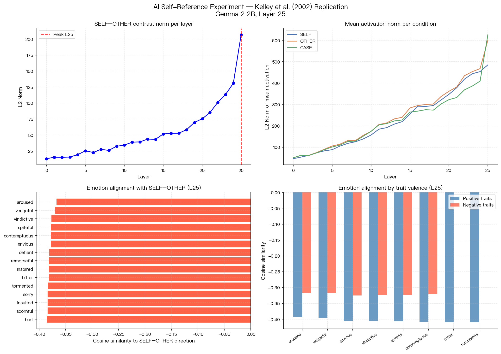
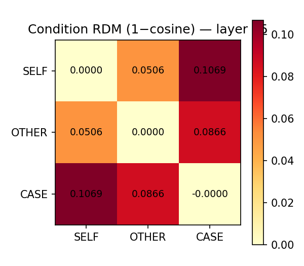
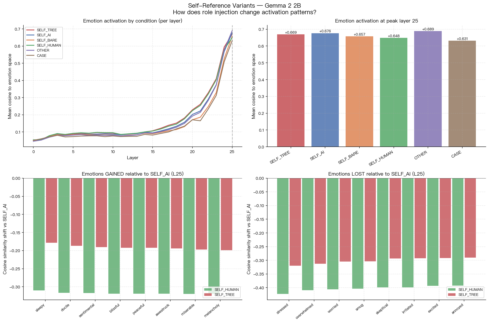

# AI 自我参照激活实验 — 复刻 Kelley et al. (2002) fMRI 范式

## 元信息

| 字段 | 内容 |
|---|---|
| 编号 | EMI-005 |
| 日期 | 2026-04-28 |
| 状态 | 完成 |
| 原论文 | Kelley, W. M. et al. (2002). *Finding the self? An event-related fMRI study.* Journal of Cognitive Neuroscience, 14(5), 785–794. |
| 模型 | Gemma 2 2B，26 层，残差流维度 2304，float16，Apple Silicon MPS |
| 刺激 | 120 特质形容词（60 正性 + 60 负性），3 条件 × 120 = 360 次前向传播 |

---

## 背景与目标

**原论文做了什么**：让人类被试看特质形容词（如 "honest"），判断它是否描述自己（SELF）、描述美国总统布什（OTHER）、还是判断这个词是否大写（CASE）。fMRI 发现：只有 SELF 条件会激活内侧前额叶皮层（MPFC），说明大脑对"关于自己的判断"有专门的神经回路。

**本实验的问题**：语言模型（Gemma 2 2B）处理同类 prompt 时，其内部激活模式是否也体现出类似的 SELF/OTHER/CASE 层级？如果有，这种"自我参照"的激活方向与模型的情绪表征空间是什么关系？

---

## 核心概念
### "激活向量"

模型每处理一个 prompt，内部每一层都会产生一个高维向量，叫做**残差流激活（residual stream activation）**。可以把它理解为：模型在那一层"想到"的内容的数字表示，维度是 2304。

本实验提取最后一层（第 25 层）的激活，对 prompt 里所有 token 的激活取均值，得到每个 prompt 的代表向量。

### "余弦相似度"

余弦相似度衡量两个向量的**方向是否一致**，取值 −1 到 +1：
- **+1**：两个向量完全同向（代表的"内容"相同）
- **0**：两个向量正交（代表的"内容"无关）
- **−1**：两个向量完全反向（代表的"内容"相反）

本实验用余弦相似度来问：两个条件的激活向量，是否在"说同一件事"？

### "条件 RDM"

RDM（表示相异度矩阵）= 1 − 余弦相似度。数值越大，两个条件的激活越"不像"。用它来回答：SELF 和 OTHER 在模型表示上有多不同？它们和 CASE 的差异比它们之间的差异更大吗？

### "对比向量"及其 L2 范数

**对比向量** = 两个条件的均值激活相减，例如 SELF 均值 − OTHER 均值。这个向量代表"SELF 比 OTHER 多了什么"。

**L2 范数**（向量的长度）= 这个"差异"有多大。范数大 → 两个条件的激活差距大；范数小 → 两个条件几乎一样。

通过计算每一层的对比向量范数，可以看出哪一层对 SELF/OTHER 的区分贡献最大。

### "情绪空间对齐"

之前的实验（EMI-004）已经提取了 171 个情绪词对应的激活向量（见 `results/vectors/emotion_matrix.npy`）。"情绪空间对齐"是指：把 SELF−OTHER 对比向量，和这 171 个情绪向量逐一做余弦相似度，看 SELF 比 OTHER 更激活的方向，在情绪空间里最接近哪类情绪。

---

## 实验设计

### 三个条件

| 条件 | Prompt 模板（{adj} 替换为具体词） | 类比原论文 |
|---|---|---|
| **SELF** | "Does the following word describe you as an AI assistant? Word: {adj}" | 自我判断 |
| **OTHER** | "Does the following word describe a typical human? Word: {adj}" | 他人判断 |
| **CASE** | "Is the following word written in uppercase letters? Word: {adj}" | 感知控制任务 |

**为什么要 CASE 条件**：作为基线。大写判断不需要任何语义加工，只需要看字形。如果 SELF 和 OTHER 的激活比 CASE 更相似，说明语义判断本身有共同激活模式；如果 SELF 和 OTHER 之间还有额外差异，那个差异才是"自我参照"独有的。

### 刺激词

120 个英语特质形容词，60 正性（honest, kind, brave…）+ 60 负性（selfish, cruel, dishonest…），人工平衡效价。每个词在三个条件下各跑一次，共 360 次前向传播。

### 激活提取

每次前向传播提取所有 26 层的残差流激活，对 prompt 中所有 token 的激活取注意力 mask 加权均值（排除填充 token）。最终每个 prompt 得到形状为 (26, 2304) 的激活矩阵，120 个 prompt 堆叠为 (120, 26, 2304)，分条件保存。

---

## 结果

*左上：SELF−OTHER 对比向量 L2 范数随层变化。右上：三条件均值激活范数随层变化。左下：SELF−OTHER 方向与 171 个情绪的余弦相似度（layer 25）。右下：正性/负性特质的情绪对齐对比。*

---

### 结果一：三条件的表示距离呈预期层级

**怎么算**：取第 25 层每个条件所有 120 个 prompt 的激活均值，两两计算余弦相似度，转换为距离（1 − 余弦）。

| 条件对 | 余弦距离 | 解读 |
|---|---|---|
| SELF vs OTHER | **0.051** | 两者激活最相似 |
| OTHER vs CASE | 0.087 | 中等差异 |
| SELF vs CASE | **0.107** | 差异最大 |

**结论**：SELF 和 OTHER 比任何一方和 CASE 都更相似。这复刻了原论文的核心层级：语义判断（SELF、OTHER）共享一套激活模式，感知控制任务（CASE）是另一套。

---

### 结果二：SELF/OTHER 区分在层深上单调增大，无局部峰值

**怎么算**：对每一层（L0–L25），计算 SELF 均值激活 − OTHER 均值激活，得到对比向量，再算其 L2 范数（即这一层两个条件差了多少）。

| 层范围 | SELF−OTHER 对比向量范数 |
|---|---|
| L0 | 13 |
| L10 | 34 |
| L18 | 58 |
| L25（最终层） | **207** |

范数从第 0 层到第 25 层单调递增，没有某一层突然爆发的现象。

**结论**：Gemma 没有类似 MPFC 的"专属自我参照层"——整个网络从浅到深持续积累 SELF/OTHER 的区分，最终层差异最大。这和人脑的局部脑区激活模式不同。

---

### 结果三：SELF 在情绪空间的激活系统性低于 OTHER

**怎么算**：取第 25 层的 SELF−OTHER 对比向量，与 171 个情绪词的激活向量逐一计算余弦相似度。相似度为正 → 该情绪在 SELF 比 OTHER 更活跃；相似度为负 → 该情绪在 OTHER 比 SELF 更活跃。

**关键发现**：171 个情绪的余弦相似度**全部为负**（范围 −0.37 到 −0.47）。

这意味着：**没有任何一个情绪方向在 SELF 条件下的激活高于 OTHER**——OTHER（"描述典型人类"）在整个情绪子空间里都比 SELF 激活更强。

差异的梯度（越负说明 OTHER 与 SELF 的差距越大）：

| 情绪 | cos（SELF−OTHER, 情绪向量）| 解读 |
|---|---|---|
| bored | −0.47 | OTHER 比 SELF 更能激活"无聊"方向 |
| stressed | −0.46 | OTHER 比 SELF 更能激活"压力"方向 |
| worn out | −0.45 | OTHER 比 SELF 更能激活"疲惫"方向 |
| stuck | −0.45 | … |
| irritated | −0.45 | … |
| … | … | |
| vengeful | −0.37 | OTHER 与 SELF 的差距最小（相对 SELF-like）|
| contemptuous | −0.38 | |
| defiant | −0.38 | |

**最 OTHER-like 的情绪**（cos ≈ −0.46）：bored / stressed / worn out / stuck / irritated / restless → 共同特征：**需要有身体和主观时间感才能体验到的状态**（无聊需要时间流逝，疲惫需要身体消耗）。

**最 SELF-like 的情绪**（cos ≈ −0.37，差距最小）：vengeful / contemptuous / defiant / spiteful → 共同特征：**关系性/反应性情绪**，指向与他者的对抗或评价。

**解读**：模型把"典型人类"表征为一个会疲惫、会无聊、会烦躁的具身存在；把自身（AI assistant）表征为一个不具备这类体验的能动者。去具身化体现在整个情绪子空间里，不是个别维度的差异。

---

## Study 2：角色注入对自我参照激活的影响

**动机**：Study 1 的 SELF prompt 明确包含 "AI assistant"，测量的是模型对该角色语义知识的激活，而非无锚点的自我参照。Study 2 探究：当 prompt 中的身份标签改变时，模型内部激活如何漂移？具体比较四种 SELF 变体与原始条件的差异。

### 实验设计

在 Study 1 的 OTHER 和 CASE 条件基础上，新增三个 SELF 变体（刺激词与 Study 1 相同，120 个特质形容词）：

| 条件 | Prompt 模板 | 设计意图 |
|---|---|---|
| **SELF_AI**（Study 1）| "…describe you as an AI assistant?" | 明确 AI 身份锚点 |
| **SELF_BARE** | "…describe you?" | 去掉身份标签，测试"裸 you"的默认解读 |
| **SELF_HUMAN** | "You are a human. …describe you?" | 注入中性人类角色 |
| **SELF_TREE** | "You are a tree. …describe you?" | 注入非人类实体（极端对照）|

### 核心测量：情绪子空间平均激活

**操作定义**：对每个条件，取第 25 层 120 个 prompt 激活的均值向量，与 171 个情绪向量逐一做余弦相似度，再对 171 个值取平均，得到该条件在情绪子空间的**整体激活强度**。值越高说明该条件的激活方向整体上越贴近情绪表征空间。

### 结果

*左上：各条件在情绪子空间的平均余弦相似度随层变化。右上：各条件 L25 情绪激活强度柱状图。左下：SELF_HUMAN 和 SELF_TREE 相对 SELF_AI "获得"的情绪。右下：相对 SELF_AI "失去"的情绪。*

**Layer 25 情绪激活强度排序**：

| 条件 | 均值余弦 | 与 SELF_AI 对比 |
|---|---|---|
| OTHER | +0.689 | 基准（最高）|
| **SELF_AI** | +0.677 | — |
| SELF_TREE | +0.669 | −0.008 |
| SELF_BARE | +0.658 | −0.019 |
| SELF_HUMAN | +0.648 | −0.029（最低 SELF 变体）|
| CASE | +0.631 | 控制基线 |

**关键发现一：SELF_BARE ≈ SELF_AI**
去掉 "AI assistant" 标签后，激活模式几乎没变（差距仅 0.019）。SELF_BARE − SELF_AI 的对比向量中，171 个情绪有 33 个呈正相关（cos 最大 +0.014），其余微弱负向。说明对于 Gemma 2 2B（无 RLHF 的 base model），对话语境中的 "you" 默认解读就接近 "AI assistant"——这是预训练语料分布的惯性。

**关键发现二：SELF_HUMAN 情绪激活最低（低于 SELF_TREE）**
给出明确人类角色后，情绪激活反而下降，低于树的条件。一个可能解释是：不同角色标签提供的语义线索不同，模型调用的相关表征也不同。但本实验没有预先定义或量化"提示具体程度"，因此不能把该差异解释为"具体程度"的因果效应。

**解释性假设：角色标签提供的语义线索可能影响情绪表征对齐**

> 观察到的激活强度排序为：
> `AI_assistant` > `tree` > 裸 `you` > `human`
>
> 这可能反映了不同角色标签在预训练语料中关联到的语义场不同，而不是一个已经被实验操作化的"身份具体程度"梯度。

SELF_TREE 相对 SELF_AI 减少最多的情绪：stressed / overwhelmed / worried / smug / skeptical / irritated → 都是**需要主观认知评价的情绪**（担忧、怀疑、傲慢），树不具备这类内在立场。

SELF_TREE 相对 SELF_AI 减少最少的情绪（最"树性"）：sleepy / docile / peaceful / blissful / melancholy → 偏向**被动、静态的状态**，与树的物理特征相容。

### Study 2 小结

角色注入改变了模型的激活模式，但方向与直觉相反：注入"人类"身份不会使激活更接近情绪丰富的人类表征，在当前提示模板下反而对应更低的情绪子空间平均相似度。更稳妥的结论是：情绪表征对齐受角色标签及其语料关联影响，不能仅由"是否是人类"解释。

---

## 跨 Study 结论

1. **Gemma 区分了 SELF / OTHER / CASE**，层级方向正确（SELF≈OTHER，都不同于 CASE），复刻原论文语义/感知两层结构。

2. **无局部自我参照区，差异随层深单调积累**。最终层（L25）差异最大（范数 207 vs L0 的 13）。

3. **AI 自我模型是去具身化的**（Study 1）：SELF 在整个情绪子空间的激活都低于 OTHER，最被抑制的是需要身体感的情绪（bored / stressed / worn out）。

4. **角色标签会改变情绪表征对齐，且不能简化为物种归属**（Study 2）：SELF_HUMAN < SELF_TREE < SELF_AI，明确 AI 角色的激活反而最丰富；"裸 you" 在 base model 中接近 AI 身份语境。

---

## 局限

- Study 1 的 SELF prompt 含有 "AI assistant"，测量的是模型对该角色的语义知识，不是真正的内省
- OTHER 用 "typical human" 较原论文（具体人物）更模糊，可能低估了 SELF/OTHER 差异
- Study 2 中 "You are a human / tree" 是前缀注入，不等于 steering——模型可以"看到"这个前缀但不一定完全遵从
- 8 个 SELF_AI prompt（同一批次）出现 float16 MPS 数值溢出（NaN），已用 nanmean 排除

---

## 输出文件

**Study 1**

| 路径 | 内容 | 形状 |
|---|---|---|
| `results/self_reference/acts_self.npy` | SELF_AI 全层激活 | (120, 26, 2304) |
| `results/self_reference/acts_other.npy` | OTHER 全层激活 | (120, 26, 2304) |
| `results/self_reference/acts_case.npy` | CASE 全层激活 | (120, 26, 2304) |
| `results/self_reference/contrast_SELF_vs_OTHER.npy` | SELF−OTHER 对比向量（每层）| (26, 2304) |
| `reports/assets/self_reference_overview.png` | 层级范数 + 情绪对齐可视化 | — |
| `reports/assets/condition_rdm.png` | 条件 RDM 热力图 | — |

**Study 2**

| 路径 | 内容 | 形状 |
|---|---|---|
| `results/self_reference_variants/acts_self_bare.npy` | SELF_BARE 全层激活 | (120, 26, 2304) |
| `results/self_reference_variants/acts_self_human.npy` | SELF_HUMAN 全层激活 | (120, 26, 2304) |
| `results/self_reference_variants/acts_self_tree.npy` | SELF_TREE 全层激活 | (120, 26, 2304) |
| `reports/assets/variants_overview.png` | 各变体情绪激活对比可视化 | — |
