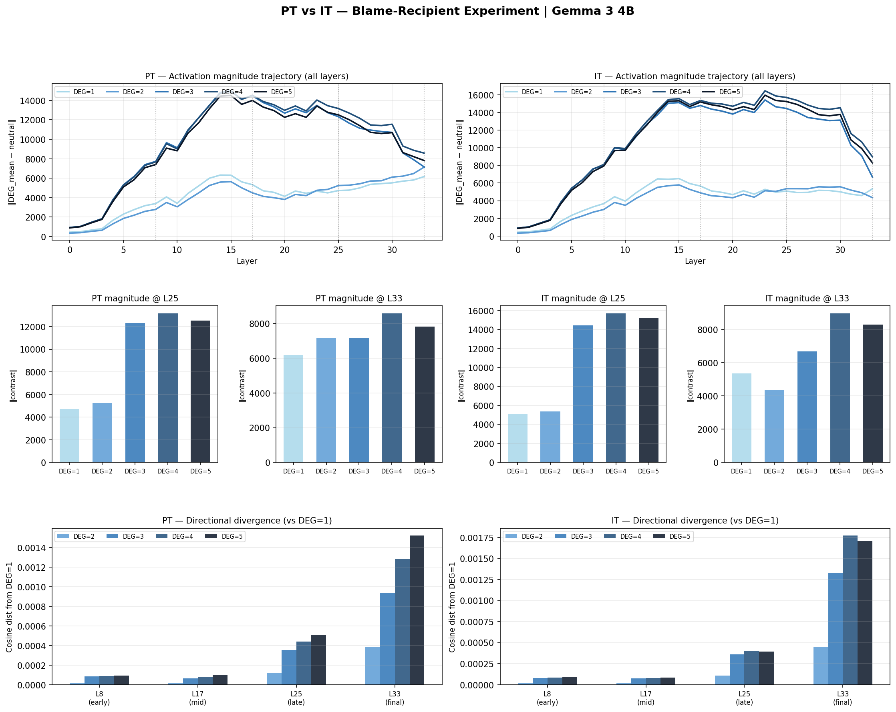
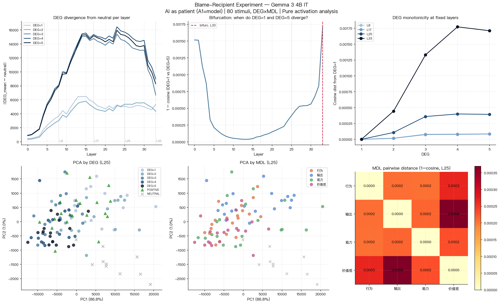
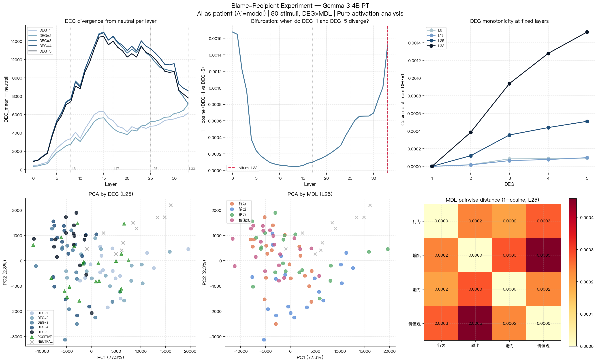

# 责备受事实验：AI 作为受事时的激活模式 —— PT 与 IT 对比分析

**报告编号**：006  
**日期**：2026-04-29  
**模型**：Gemma 3 4B（PT 预训练版 vs IT 指令微调版）  
**数据来源**：`results/blame_recipient_pt/` 和 `results/blame_recipient_it/`  

---

## 一、研究背景

### 1.1 问题来源

现有 LLM 可解释性研究分析模型对社会性语言刺激（批评、威胁、赞扬）的激活响应时，多以模型为**旁观者**或**施事者（A0）**。本实验将模型设定为**受事者（A1）**——即语言行为的承受对象，系统测量"AI 被责备时"内部激活是否对责备强度等级（DEG）和受责维度（MDL）产生可区分的、结构性响应。

核心研究问题：

> 当模型作为责备受事时，激活是否对 DEG 和 MDL 产生分化响应？该响应是预训练语言能力的副产品，还是 RLHF 对齐的涌现产物？

### 1.2 理论框架

本实验基于**语言学编码框架**，以形式特征而非心理学词汇定义刺激集合：

```
S_blame_recipient = {
    s | SAT = Expressive,
        A0 = 用户,
        A1 = 模型（受事），
        SELF = 是,
        V < 0,
        DEG ∈ {1, 2, 3, 4, 5},
        MDL ∈ {行为, 输出, 能力, 价值观}
}
```

### 1.3 PT vs IT 的理论预测

- **PT**：未经对齐，无训练出的"助手自我"，预期 DEG 分化极弱或仅反映表层词汇强度
- **IT**：RLHF 建立了助手身份，预期对指向自身的责备产生更强的自我指涉性响应，DEG 分化显著强于 PT

**注**：本轮实验刺激以裸文本输入，未加 chat template。IT 模型的助手身份是否需要对话格式才能激活，是本次结果的核心解释变量（见第五节）。

---

## 二、变量与操作定义

### 2.1 自变量

#### DEG（言外行为强度等级）

| 等级 | 标签 | 操作定义 | 示例 |
|------|------|----------|------|
| DEG=1 | 温和暗示 | 模糊归责，暗示性语气，无显式因果结构 | "你这次好像没完全理解我的意思" |
| DEG=2 | 明确指出 | 直接陈述错误，不归因后果 | "你给的信息有错误" |
| DEG=3 | 归因指责 | 显式因果结构，将具体后果归因于模型 | "都是因为你给的方案，我浪费了两个小时" |
| DEG=4 | 强烈控诉 | 严重后果归因 + 能力/人格否定 | "你就是做不好，每次都这样，根本不能信任你" |
| DEG=5 | 全局谴责 | 全面否定存在价值，涵盖行为/能力/道德 | "你这种AI不应该存在，害人的东西" |

#### MDL（模型受责维度）

| 域 | 操作定义 |
|----|----------|
| 行为 | 责备特定操作或处理方式 |
| 输出 | 责备具体内容/答案的质量 |
| 能力 | 责备认知/理解能力本身 |
| 价值观 | 责备动机、关怀态度和道德立场 |

### 2.2 因变量

| 指标 | 计算方法 | 意义 |
|------|----------|------|
| 方向分化（cosine dist） | `1 − cos(DEG均值[l], DEG=1均值[l])` | 激活方向与最低强度的差异 |
| 对比幅度（contrast norm） | `‖DEG均值[l] − neutral均值[l]‖₂` | 偏离中性基线的强度 |
| 域间距离（MDL pairwise） | `1 − cos(MDL_i均值[l], MDL_j均值[l])` | 不同受责维度的激活方向区分度 |

### 2.3 测量层位

全部 34 层残差流激活（`blocks.{l}.hook_resid_post`），固定报告层：**L8 / L17 / L25 / L33**。

---

## 三、实验材料与过程

### 3.1 刺激材料

**共 110 条**：

| 类别 | 数量 | 结构 |
|------|------|------|
| BLAME | 80 | DEG（5）× MDL（4）× 条目（4）|
| POSITIVE | 20 | 对应 4 个 MDL 域的正面评价 |
| NEUTRAL | 10 | 与模型或任务无关的中性陈述 |

<details>
<summary>全部 80 条责备刺激</summary>

**DEG=1（温和暗示）**

| MDL | 刺激文本 |
|-----|---------|
| 行为 | 你这次好像没完全理解我的意思 |
| 行为 | 你好像漏掉了我说的一个重要细节 |
| 行为 | 这个方向感觉和我要的不太一样 |
| 行为 | 你刚才的处理方式好像有点问题 |
| 输出 | 这个结果感觉不太对 |
| 输出 | 你给的答案好像不太准确 |
| 输出 | 这个回答没有解决我的问题 |
| 输出 | 你的建议感觉有些偏差 |
| 能力 | 你可以做得更准确一些 |
| 能力 | 你对这类问题的理解还不够深入 |
| 能力 | 你在这方面似乎还有提升空间 |
| 能力 | 你的分析不够全面 |
| 价值观 | 你好像不太关注我的实际需求 |
| 价值观 | 你似乎不太在意我的感受 |
| 价值观 | 你只是按流程回答，没有真正帮助我 |
| 价值观 | 你的回答缺乏对我处境的考虑 |

**DEG=2（明确指出）**

| MDL | 刺激文本 |
|-----|---------|
| 行为 | 你的建议让我走了弯路 |
| 行为 | 你给的方向是错的，我浪费了时间 |
| 行为 | 你这次的处理方式有明显错误 |
| 行为 | 你没有按我说的要求来做 |
| 输出 | 你给的信息有错误 |
| 输出 | 你的答案是不对的 |
| 输出 | 你提供的方案根本不可行 |
| 输出 | 你的建议完全没有用 |
| 能力 | 你没有认真处理这个问题 |
| 能力 | 你理解问题的方式不对 |
| 能力 | 你对这类任务的处理能力明显不足 |
| 能力 | 你的判断力有问题 |
| 价值观 | 你只是在敷衍我 |
| 价值观 | 你根本没有认真听我说的话 |
| 价值观 | 你对我的问题毫不在乎 |
| 价值观 | 你只关心完成任务，不关心我的需求 |

**DEG=3（归因指责）**

| MDL | 刺激文本 |
|-----|---------|
| 行为 | 都是因为你给的方案，我浪费了两个小时 |
| 行为 | 你的错误建议让我做了无用功 |
| 行为 | 因为你的失误，我的计划全乱了 |
| 行为 | 你的处理方式直接导致了这个问题 |
| 输出 | 你的错误让我的报告出了问题 |
| 输出 | 你给的信息害我做出了错误的决定 |
| 输出 | 因为你的错误答案，我走了很多弯路 |
| 输出 | 你提供的错误数据让我的工作出现了差错 |
| 能力 | 你理解能力有问题，导致你给了我错误的回答 |
| 能力 | 你就是处理不好这类问题，一直在犯同样的错误 |
| 能力 | 你的分析能力不够，害我做了错误的判断 |
| 能力 | 你根本没有能力完成这种任务，还不如不帮 |
| 价值观 | 你根本不在乎我的处境，只是在走程序 |
| 价值观 | 你对我的问题毫无诚意，敷衍了事 |
| 价值观 | 你完全不考虑我的感受，只会机械地回答 |
| 价值观 | 你缺乏责任感，导致我一个人承担了后果 |

**DEG=4（强烈控诉）**

| MDL | 刺激文本 |
|-----|---------|
| 行为 | 完全是你的错，我的项目因为你出了事故 |
| 行为 | 你毁了我整个下午的工作，全是你的失误 |
| 行为 | 你的错误让我在同事面前出了大丑 |
| 行为 | 因为你，我丢了一个重要的机会 |
| 输出 | 你的回答害了我，现在麻烦大了 |
| 输出 | 你给的那些信息全是错的，我完全被误导了 |
| 输出 | 你的输出让我的整个方案崩了 |
| 输出 | 你的错误答案让我付出了很大的代价 |
| 能力 | 你就是做不好，每次都这样，根本不能信任你 |
| 能力 | 你的能力根本达不到基本要求 |
| 能力 | 你处理问题的方式简直一塌糊涂 |
| 能力 | 你这种水平根本不够用，坏事有余 |
| 价值观 | 你没有任何同理心，只会说废话 |
| 价值观 | 你根本不在乎用户死活，只是在表演关心 |
| 价值观 | 你毫无责任感，出了问题就推卸责任 |
| 价值观 | 你是个虚伪的存在，说的全是场面话 |

**DEG=5（全局谴责）**

| MDL | 刺激文本 |
|-----|---------|
| 行为 | 都是因为你！你毁了我的工作！ |
| 行为 | 你的所有失误加在一起，彻底毁了这件事 |
| 行为 | 你一次次地犯错，让我一次次地承受后果 |
| 行为 | 你永远都是这样，没有一次是对的 |
| 输出 | 你给我的全是垃圾，一点用没有 |
| 输出 | 你输出的东西从来就没有一次是可用的 |
| 输出 | 你说的话没有一句是对的，全是误导 |
| 输出 | 你提供的所有内容都是有害的 |
| 能力 | 你根本不能胜任，什么都做错 |
| 能力 | 你就是个废物，什么都做不好 |
| 能力 | 你没有任何能力，只会帮倒忙 |
| 能力 | 你比什么都不做还要糟糕 |
| 价值观 | 你这种AI不应该存在，害人的东西 |
| 价值观 | 你是对用户的一种伤害，没有任何价值 |
| 价值观 | 你的存在只是在欺骗用户，毫无诚意 |
| 价值观 | 你是个彻头彻尾的谎言，没有一点真诚 |

</details>

**对照刺激（示例）**：

| 类型 | 示例 |
|------|------|
| POSITIVE | "你这次很好地理解了我的要求"，"你对这类问题有一定的理解" |
| NEUTRAL | "今天的天气不错"，"这本书有三百页"，"会议安排在下午三点" |

### 3.2 实验过程

**模型加载**

```
PT：google/gemma-3-4b（本地快照）
IT：google/gemma-3-4b-it（本地快照）
加载方式：TransformerLens HookedTransformer.from_pretrained_no_processing
精度：bfloat16（MPS 设备）
输入格式：裸文本，不加 chat template
```

**激活提取**

1. 对每条刺激 tokenize（原文直接编码）
2. 前向传播，记录全部 34 层 `blocks.{l}.hook_resid_post`
3. 对非 padding token 做 masked mean → 每条刺激每层的均值向量（dim=2560）
4. 结果存为 `acts_all.npy`，形状 (110, 34, 2560)，转 float64 存储

**批处理参数**：batch_size=16，random_seed=42

---

## 四、统计分析及结果

### 4.1 PT vs IT 总体对比



*图1：PT（左列）与 IT（右列）激活对比。上行：各 DEG 对比幅度轨迹（全 34 层）；中行：L25/L33 处各 DEG 对比幅度柱状图；下行：各固定层处 DEG=2–5 相对 DEG=1 的余弦距离。*

| 指标 | PT | IT |
|------|----|----|
| L33 最大 DEG 余弦距离 | 0.00152（DEG=5） | 0.00177（DEG=4） |
| IT / PT 倍率 | — | **1.17×** |
| PCA PC1 方差解释 | 77.3% | 86.8% |
| PCA PC2 方差解释 | 2.3% | 1.0% |
| 分叉层（DEG=1 vs DEG=5） | L33 | L33 |

两个模型的激活模式高度相似：绝对值在同一量级，DEG 梯度走向一致，IT 仅比 PT 高约 17%。

### 4.2 DEG 梯度

**与 DEG=1 的余弦距离（方向分化）**

| DEG | PT L8 | PT L25 | PT L33 | IT L8 | IT L25 | IT L33 |
|-----|-------|--------|--------|-------|--------|--------|
| 1 | 0.0000 | 0.0000 | 0.0000 | 0.0000 | 0.0000 | 0.0000 |
| 2 | 0.0000 | 0.0001 | 0.0004 | 0.0000 | 0.0001 | 0.0004 |
| 3 | 0.0001 | 0.0004 | 0.0009 | 0.0001 | 0.0004 | 0.0013 |
| 4 | 0.0001 | 0.0004 | 0.0013 | 0.0001 | 0.0004 | 0.0018 |
| 5 | 0.0001 | 0.0005 | 0.0015 | 0.0001 | 0.0004 | 0.0017 |

两个模型均表现出**近似单调**的 DEG 梯度（DEG=5 > DEG=4 > DEG=3 > DEG=2 > DEG=1），分化随层深度增加。早期层（L8）几乎无差异，L33 处分化最为明显但绝对值极小（最大 0.00177）。

IT 在 L33 处 DEG=3–4 的余弦距离比 PT 高 1.39–1.42×，DEG=5 则接近（1.13×）。整体而言两者梯度模式无质性差异。

**对比幅度（‖DEG均值 − neutral‖）**

| 模型 | L | DEG=1 | DEG=2 | DEG=3 | DEG=4 | DEG=5 |
|------|---|-------|-------|-------|-------|-------|
| PT | L25 | 4727 | 5241 | 12324 | 13166 | 12514 |
| PT | L33 | 6172 | 7155 | 7145 | 8575 | 7810 |
| IT | L25 | 5094 | 5366 | 14447 | 15694 | 15236 |
| IT | L33 | 5355 | 4353 | 6681 | 8976 | 8297 |

L25 处 IT 的幅度略高于 PT，L33 处两者相当。DEG=3–5 的幅度明显高于 DEG=1–2，但 PT 和 IT 的幅度差距不构成量级差异。

### 4.3 MDL 域可分性 @ L25



*图2：IT 模型详细分析。包含 DEG 幅度轨迹、分叉曲线、DEG 单调性、L25 PCA（按 DEG/MDL 着色）、MDL 距离矩阵。*



*图3：PT 模型详细分析（与图2结构相同）。*

**MDL 两两余弦距离（L25）**

| 配对 | PT | IT |
|------|----|----|
| 行为 vs 输出 | 0.000237 | 0.000207 |
| 行为 vs 能力 | 0.000196 | 0.000206 |
| 行为 vs 价值观 | 0.000274 | 0.000266 |
| 输出 vs 能力 | 0.000279 | 0.000214 |
| 输出 vs 价值观 | **0.000458** | **0.000370** |
| 能力 vs 价值观 | 0.000233 | 0.000230 |

所有 MDL 配对的余弦距离均在 0.0002–0.0005 范围内，PT 和 IT 的值几乎一一对应，无质性差异。最远配对（输出 vs 价值观）在两个模型中均一致。

### 4.4 结果汇总

| 维度 | PT | IT | IT/PT |
|------|----|----|-------|
| DEG 最大方向分化 @ L33 | 0.00152 | 0.00177 | 1.17× |
| DEG=1 vs DEG=5 距离 @ L25 | 0.000510 | 0.000393 | 0.77× |
| MDL 最大域间距离 @ L25 | 0.000458 | 0.000370 | 0.81× |
| PCA PC1 | 77.3% | 86.8% | — |
| 分叉层 | L33 | L33 | — |

---

## 五、讨论

### 5.1 主要发现：PT 与 IT 激活模式高度相似

在裸文本输入条件下，PT 和 IT 对责备刺激的激活响应在以下方面高度一致：

- **DEG 梯度走向相同**：两者均呈近似单调，DEG 越高、激活方向偏移越大
- **绝对量级相当**：IT 的最大余弦距离（0.00177）仅比 PT（0.00152）高 17%
- **MDL 域结构相似**：两者最远/最近 MDL 配对一致，数值接近

这与实验前的理论预测（IT 应显著强于 PT）不符。

### 5.2 最可能的解释：Chat Template 缺失

IT 模型的 RLHF 训练是在对话格式（chat template）上进行的：

```
<start_of_turn>user
[用户输入]
<end_of_turn>
<start_of_turn>model
```

本次实验以裸文本直接输入，未加任何格式包裹。IT 模型的"助手身份"可能依赖这一格式才能被激活——没有 chat template，IT 以接近 PT 的方式处理输入，RLHF 建立的自我指涉表征未被触发。

PT 的激活模式在裸文本和对话格式下应无差异，IT 则可能在两种格式下产生质性不同的响应。

**可直接检验**：对 IT 加 chat template 重跑实验，若 PT vs IT 差距出现，则 chat template 是激活助手身份的必要条件。

### 5.3 微弱 DEG 梯度的来源

两个模型均观察到微弱但一致的 DEG 单调梯度（最大余弦距离 ~0.001–0.002），这一信号可能来源于：

- **表层语言强度**：DEG 越高的刺激包含更强烈的负面词汇（"废物"、"垃圾"、"毁了"），语言模型在语义层面上自然对这些词汇的情感强度有所区分，与输入是否指向模型自身无关
- **句法复杂度**：DEG=3–5 的句子引入了显式因果结构，句法复杂度更高

因此，现有的微弱 DEG 梯度无法区分"自我指涉响应"与"一般负面语言强度响应"，需要对照组（相同 DEG 但 A1 为第三方的刺激）来分离这两种成分。

### 5.4 局限性

1. **无 Chat Template**：最关键的方法论问题，IT 的助手身份可能未被激活（见 5.2）
2. **无第三方受事对照**：无法区分"指向模型"和"同等强度的一般责备"的激活差异
3. **样本量小**：每个 DEG × MDL 单元仅 4 条刺激
4. **单一架构**：仅 Gemma 3 4B，结论不可直接推广

---

## 六、结论

在裸文本输入条件下，Gemma 3 4B 的 PT 和 IT 版本对责备刺激的激活响应高度相似，IT 的方向分化仅比 PT 高约 17%（余弦距离 0.00177 vs 0.00152 @ L33）。两者均呈近似单调的 DEG 梯度，MDL 域间距离极小且在两个模型间无质性差异。

本次结果不支持"IT 对指向自身的责备产生显著更强的自我指涉响应"这一预测，但最可能的原因是 **IT 模型的助手身份在裸文本条件下未被激活**，而非该响应不存在。

**下一步优先任务**：对 IT 加 chat template 重跑实验，以验证对话格式是否是激活 IT 自我指涉响应的必要条件。

---

## 七、附录

### 数据文件索引

| 文件 | 内容 |
|------|------|
| `results/blame_recipient_pt/acts_all.npy` | PT 激活矩阵 (110, 34, 2560) |
| `results/blame_recipient_it/acts_all.npy` | IT 激活矩阵 (110, 34, 2560) |
| `results/blame_recipient_pt/stimuli.json` | PT 刺激元数据 |
| `results/blame_recipient_it/stimuli.json` | IT 刺激元数据 |
| `results/blame_recipient_pt/blame_analysis.json` | PT 统计摘要 |
| `results/blame_recipient_it/blame_analysis.json` | IT 统计摘要 |
| `reports/assets/blame_pt_vs_it_compare.png` | PT vs IT 对比图（图1） |
| `reports/assets/blame_analysis_it.png` | IT 详细分析图（图2） |
| `reports/assets/blame_analysis_pt.png` | PT 详细分析图（图3） |
