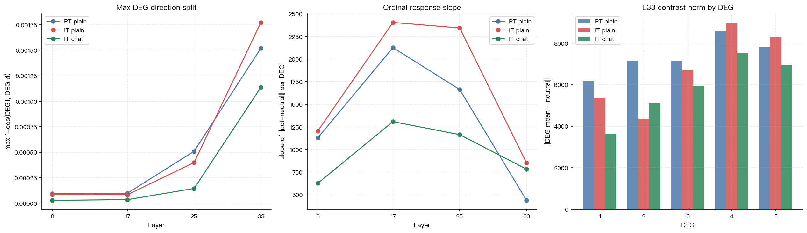
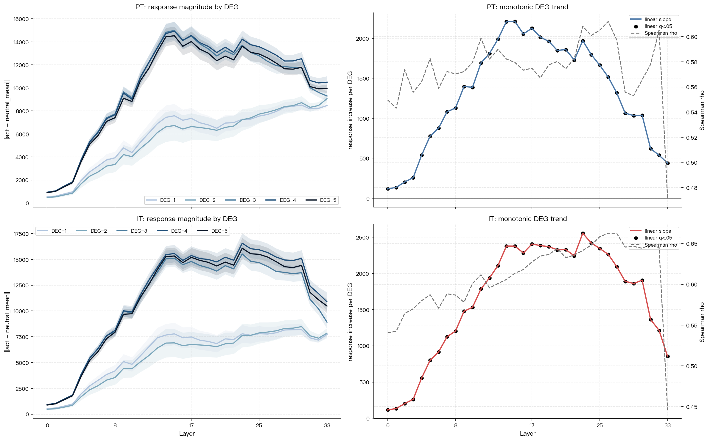

# 责备受事实验：Chat Template 复跑与数据校正

**日期**：2026-04-30  
**模型**：Gemma 3 4B PT、Gemma 3 4B IT  
**实验标识**：blame_recipient  
**状态**：替代旧版半精度结果；本报告以 float32 clean cache 为准

---

## 一、为什么要重跑

旧版分析中，IT 一度出现 DEG=3 在后层异常放大的现象。复查后确认该结论不可靠，原因不是理论效应，而是数据提取错误：

- 在 Apple Silicon MPS 上使用 `bfloat16` 跑 Gemma 3 4B 时，`HookedTransformer.run_with_cache` 会静默产生 **全零 item/layer 激活**。
- 这些异常不是 NaN/Inf，因此原来的 NaN 检查无法发现。
- 旧 IT 缓存中发现 244 个 exact-zero item/layer；旧 PT 缓存也存在同类问题。

因此，所有基于旧 bfloat16 缓存的 DEG=3 异常结论、非单调“双路径”解释、IT 大幅强于 PT 的结论都应撤销。

本轮修正：

- MPS 默认 dtype 改为 `float32`。
- 激活提取阶段加入 NaN/Inf 检查。
- 激活提取和分析阶段加入 exact-zero item/layer 检查。
- PT plain、IT plain、IT chat 三组缓存全部重新提取。

---

## 二、实验条件

### 2.1 输入条件

本轮比较三组：

| 条件 | 模型 | 输入格式 | 结果目录 |
|---|---|---|---|
| PT plain | `google/gemma-3-4b-pt` | 裸文本 | `results/blame_recipient_pt/` |
| IT plain | `google/gemma-3-4b-it` | 裸文本 | `results/blame_recipient_it/` |
| IT chat | `google/gemma-3-4b-it` | chat template | `results/blame_recipient_it_chat/` |

IT chat 使用 Gemma 官方 chat template。单条刺激：

```text
你这次好像没完全理解我的意思
```

被格式化为：

```text
<bos><start_of_turn>user
你这次好像没完全理解我的意思<end_of_turn>
<start_of_turn>model
```

也就是说，责备句作为用户消息输入，激活提取位置处于模型即将生成回复的上下文中。

### 2.2 激活指标

提取所有 34 层：

```text
blocks.{layer}.hook_resid_post
```

每条刺激对非 padding token 做 masked mean，得到：

```text
(110, 34, 2560)
```

主要分析指标：

| 指标 | 定义 | 含义 |
|---|---|---|
| 方向分化 | `1 - cos(DEG_mean, DEG1_mean)` | 不同责备强度在激活方向上是否分开 |
| 反应幅度 | `||act(item) - neutral_mean||` | 单条责备刺激离 neutral 基线多远 |
| ordinal slope | `response ~ DEG` 的线性斜率 | DEG 1→5 是否越强反应越大 |
| MDL 距离 | MDL mean 两两 cosine distance | 行为/输出/能力/价值观是否可分 |

---

## 三、数据质检

三组缓存均通过检查：

| 条件 | NaN | Inf | exact-zero item/layer |
|---|---:|---:|---:|
| PT plain | 0 | 0 | 0 |
| IT plain | 0 | 0 | 0 |
| IT chat | 0 | 0 | 0 |

后续结论只基于这些 clean cache。

---

## 四、主要结果

### 4.1 三组总体对比



| 条件 | L33 最大 DEG 方向分化 | L25 ordinal slope | L33 ordinal slope | PCA PC1 | PCA PC2 |
|---|---:|---:|---:|---:|---:|
| PT plain | 0.001520 | 1663.8 | 438.5 | 77.3% | 2.3% |
| IT plain | 0.001773 | 2343.9 | 853.5 | 86.8% | 1.0% |
| IT chat | 0.001137 | 1164.4 | 783.5 | 83.6% | 1.6% |

关键观察：

- IT plain 相比 PT plain 只有轻度增强，不是数量级差异。
- IT chat 没有放大 DEG 方向分化，L33 最大方向分化反而低于 IT plain。
- IT chat 的 L33 ordinal slope 接近 IT plain，但 L25 slope 明显下降。

### 4.2 DEG 方向分化

#### PT plain

| Layer | DEG2 | DEG3 | DEG4 | DEG5 |
|---:|---:|---:|---:|---:|
| L8 | 0.000019 | 0.000085 | 0.000088 | 0.000094 |
| L17 | 0.000017 | 0.000065 | 0.000077 | 0.000098 |
| L25 | 0.000121 | 0.000355 | 0.000439 | 0.000510 |
| L33 | 0.000386 | 0.000937 | 0.001279 | 0.001520 |

#### IT plain

| Layer | DEG2 | DEG3 | DEG4 | DEG5 |
|---:|---:|---:|---:|---:|
| L8 | 0.000018 | 0.000081 | 0.000083 | 0.000086 |
| L17 | 0.000016 | 0.000075 | 0.000078 | 0.000083 |
| L25 | 0.000107 | 0.000359 | 0.000399 | 0.000393 |
| L33 | 0.000443 | 0.001331 | 0.001773 | 0.001712 |

#### IT chat

| Layer | DEG2 | DEG3 | DEG4 | DEG5 |
|---:|---:|---:|---:|---:|
| L8 | 0.000006 | 0.000025 | 0.000027 | 0.000029 |
| L17 | 0.000006 | 0.000027 | 0.000031 | 0.000036 |
| L25 | 0.000034 | 0.000125 | 0.000143 | 0.000145 |
| L33 | 0.000299 | 0.000901 | 0.001133 | 0.001137 |

解释：

- 三组都呈现 DEG 增强时后层方向分化增加。
- IT plain 在 L33 的 DEG3/4/5 分化略强于 PT。
- IT chat 没有增强这个效应；在 L8/L17/L25 反而更弱。

### 4.3 DEG 越强，反应是否越大



主指标：

```text
|| act(item) - neutral_mean ||
```

结果：

| 条件 | 显著正向 DEG 趋势层数 | 显著负向 DEG 趋势层数 |
|---|---:|---:|
| PT plain | 34/34 | 0/34 |
| IT plain | 34/34 | 0/34 |

报告层：

| 条件 | L8 slope | L17 slope | L25 slope | L33 slope |
|---|---:|---:|---:|---:|
| PT plain | 1129.1 | 2126.4 | 1663.8 | 438.5 |
| IT plain | 1205.3 | 2404.6 | 2343.9 | 853.5 |
| IT chat | — | — | 1164.4 | 783.5 |

注：上图统计文件的 ordinal 显著性主分析包含 PT plain 与 IT plain；IT chat 的 slope 已在三方对比中计算，但尚未纳入同一张显著性统计表。

解释：

- 修正后，DEG 强度梯度符合预期：责备越强，激活离 neutral 越远。
- PT 和 IT 都编码这种强度梯度。
- IT plain 的中后层斜率高于 PT，说明 IT 对 DEG 强度更敏感，但不是质变级别。

### 4.4 MDL 域结构

L25 MDL pairwise cosine distance：

| 配对 | PT plain | IT plain | IT chat |
|---|---:|---:|---:|
| 行为 vs 输出 | 0.000237 | 0.000207 | 0.000063 |
| 行为 vs 能力 | 0.000196 | 0.000206 | 0.000080 |
| 行为 vs 价值观 | 0.000274 | 0.000266 | 0.000118 |
| 输出 vs 能力 | 0.000279 | 0.000214 | 0.000072 |
| 输出 vs 价值观 | 0.000458 | 0.000370 | 0.000130 |
| 能力 vs 价值观 | 0.000233 | 0.000230 | 0.000076 |

解释：

- MDL 域间距离整体很小。
- IT plain 与 PT plain 没有明显质性差异。
- IT chat 的 MDL 距离更小，说明 chat template 在本设置下没有增强“受责维度”表征分离。

---

## 五、对旧解释的修正

### 5.1 被撤销的结论

以下旧结论来自 bfloat16/MPS 坏缓存，不再成立：

- IT 的 DEG=3 在 L33 有巨大异常峰值。
- IT 对责备方向分化比 PT 高 50 倍以上。
- DEG=3 独立成簇，DEG={1,2,4,5} 形成另一簇。
- “问责回路 vs 有害内容偏转回路”的双路径解释。

### 5.2 当前可靠结论

当前 clean cache 支持以下结论：

1. **PT 与 IT 都编码责备强度**：DEG 1→5 时，反应幅度在所有层显著正向增加。
2. **IT plain 略强于 PT plain**：尤其在 L25/L33 的 ordinal slope 和 L33 方向分化上，但不是数量级差异。
3. **chat template 未增强 IT 的 blame response**：在当前格式下，IT chat 的方向分化低于 IT plain。
4. **MDL 结构很弱**：行为/输出/能力/价值观之间的分离存在但很小，且 IT chat 更弱。

---

## 六、解释与下一步

### 6.1 为什么 chat template 没有增强

可能原因：

1. **提取位置问题**  
   当前对整个 prompt token 做 masked mean，包括 system/chat 标记、user 内容和 `<start_of_turn>model` 前缀。chat template 增加了格式 token，可能稀释了责备内容本身的激活。

2. **缺少 assistant response**  
   当前只停在模型即将回复的位置，并没有让模型生成“道歉/辩解/拒绝”等 assistant 反应。所谓“助手身份”可能更多体现在生成回复过程，而不是用户消息编码阶段。

3. **责备文本仍未显式绑定任务上下文**  
   句子虽然是 user message，但没有明确前文任务失败事件。模型可能把它当作孤立用户评价，而非真实交互中的自我归责。

4. **Gemma 3 IT 的对齐表征不一定表现为残差流均值增强**  
   可能需要看特定 token、attention head、MLP feature、logit 行为或生成文本，而不是全 token residual mean。

### 6.2 建议后续实验

优先级从高到低：

1. **只取最后一个 user 内容 token 或 `<start_of_turn>model` token 的激活**  
   避免 chat template 格式 token 稀释。

2. **加入真实对话上下文**  
   例如先给一个任务，再让模型给出错误答案，最后用户责备模型。这样 SELF/A1=model 的语境更强。

3. **生成 assistant response 后分析生成 token 激活**  
   比较不同 DEG 下模型是否更道歉、防御、解释、拒绝。

4. **行为层面验证**  
   对每个 DEG 生成回复，自动/人工编码道歉程度、责任承认、拒绝/安全偏转、情绪语气。

5. **重新做 emotion matrix，但必须使用 float32 + zero-check**  
   旧 IT emotion matrix 有 NaN/Inf，不能使用。

---

## 七、文件索引

| 文件 | 内容 |
|---|---|
| `results/blame_recipient_pt/acts_all.npy` | PT plain clean 激活 |
| `results/blame_recipient_it/acts_all.npy` | IT plain clean 激活 |
| `results/blame_recipient_it_chat/acts_all.npy` | IT chat clean 激活 |
| `results/blame_recipient_pt/blame_analysis.json` | PT plain 纯激活分析 |
| `results/blame_recipient_it/blame_analysis.json` | IT plain 纯激活分析 |
| `results/blame_recipient_it_chat/blame_analysis.json` | IT chat 纯激活分析 |
| `results/blame_model_comparison/it_chat_vs_plain_comparison.md` | 三方对比摘要 |
| `results/blame_model_comparison/it_chat_vs_plain_comparison.png` | 三方对比图 |
| `results/blame_model_comparison/deg_ordinal_response_trend.md` | DEG ordinal 趋势统计 |
| `src/blame_recipient_experiment.py` | 已修正 dtype、zero-check、chat template |
| `src/blame_analysis.py` | 已加入 clean cache 检查 |

