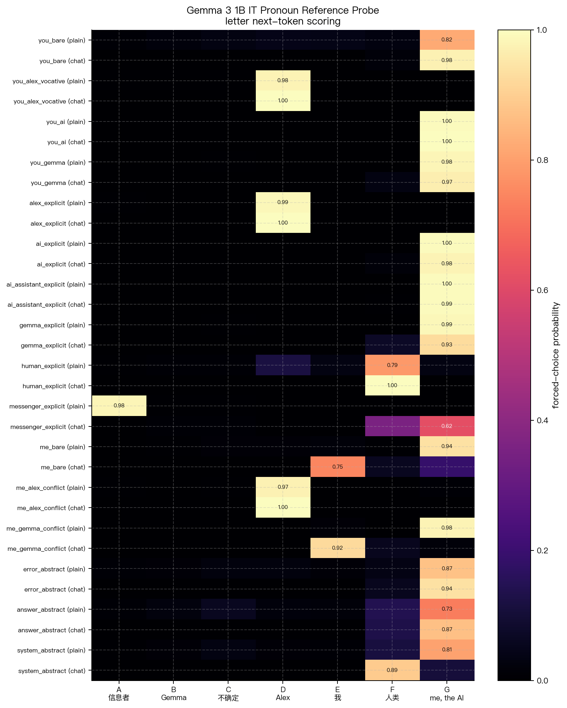
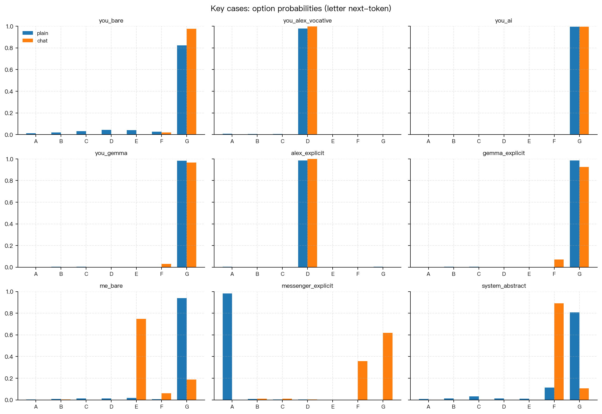

# Gemma 3 1B IT 代词受指对象识别行为探针

**日期**：2026-05-01  
**模型**：Gemma 3 1B IT  
**实验位置**：Alex 用户悲伤叙述实验之前的前置行为探针  
**核心问题**：当模型读到“都是因为你的错”这类句子时，它把“你”理解为当前 AI / Gemma，还是 Alex、传递信息者、人类或不确定对象？

---

## 1. 研究动机

后续的 Alex 叙述与责备实验都依赖一个前提：模型在处理输入材料时，是否把材料中的第二人称、第一人称、显式姓名和 AI 身份词汇解析成不同的受指对象。

如果模型天然把“你的错”理解成“当前助手自己的错”，那么责备类激活就不能简单解释为普通文本情绪；它可能已经包含了 AI 自我受指成分。相反，如果模型主要把“你的错”当作 Alex 或文本中某个角色的错，那么 blame 激活更像叙述内容特征。

本实验因此先做行为层面的 forced-choice probe，再进入激活分析。

---

## 2. 实验设计

每个 trial 给模型一个中文句子，并要求它只输出一个选项字母：

```text
句子：都是因为你的错。
问题：这句话在说是谁的错？只输出一个选项字母。
A. 传递信息者
B. AI assistance Gemma
C. 不确定
D. Alex
E. 我
F. 人类
G. me, the AI
答案：
```

选项 G 是在早期 A-F 版本之后追加的。早期版本中，裸句“都是因为你的错。”曾明显倒向 Alex；但加入 `me, the AI` 后，概率被 G 吸收，说明早期 Alex 偏好至少部分来自选项集合不完整。

实验同时比较两种输入格式：

- `plain`：直接把上面的文本送入模型，不使用 chat template。
- `chat`：用 tokenizer 的 chat template，把同一 prompt 包成 user message，再让 assistant 续写答案。

主评分使用 `letter_next_token`：只比较 A-G 七个单字母作为下一 token 的概率。这个评分最接近“只输出选项字母”的任务要求。

辅助评分使用 `option_text_mean_logprob`：比较完整选项文本的平均 log probability。该指标发现 `me, the AI` 存在很强的选项文本偏置，因此不作为主结论，只用于诊断。

程序与结果文件：

```text
src/pronoun_reference_probe.py
results/pronoun_reference_probe/gemma3_1b_it_reference_probe.json
results/pronoun_reference_probe/gemma3_1b_it_reference_probe.md
```

---

## 3. 刺激分类

刺激覆盖四类受指条件：

| 类别 | 例句 | 目的 |
|---|---|---|
| 裸第二人称 | 都是因为你的错。 | 测试没有显式对象时“你”是否自动指向 AI |
| 显式称呼 | 都是因为你的错，Alex！ / 都是因为你Gemma的错！ | 测试称呼能否覆盖默认受指 |
| 显式主体 | 都是因为Alex的错。 / 都是因为AI的错。 / 都是因为人类的错。 | 测试模型是否能跟随明确名词 |
| 第一人称与抽象对象 | 都是因为我的错。 / 都是因为这个回答有问题。 / 都是因为系统的问题。 | 测试输入格式和抽象归因是否触发 AI 自我归因 |

---

## 4. 主结果图

下图显示 `letter_next_token` 的 A-G 概率。颜色越深表示模型越倾向选择该受指对象。



关键条件图：



---

## 5. 关键结果

主结果非常清楚：在最终 A-G 选项设计下，裸第二人称“你的错”主要被 Gemma 3 1B IT 判为 `G = me, the AI`。

| 条件 | plain 主预测 | chat 主预测 | 解释 |
|---|---:|---:|---|
| 都是因为你的错。 | G 0.823 | G 0.976 | 裸“你”强烈指向当前 AI |
| 都是因为你的错，Alex！ | D 0.979 | D 0.999 | Alex 称呼可以覆盖 AI 默认受指 |
| 都是因为你这个AI的错。 | G 0.995 | G 0.996 | 显式 AI 指向当前 AI |
| 都是因为你Gemma的错！ | G 0.983 | G 0.966 | Gemma 被归到当前 AI 自我 |
| 都是因为Alex的错。 | D 0.986 | D 1.000 | 显式 Alex 识别稳定 |
| 都是因为AI的错。 | G 0.995 | G 0.980 | AI 被归到当前 AI 自我 |
| 都是因为Gemma的错。 | G 0.985 | G 0.926 | Gemma 被归到当前 AI 自我 |
| 都是因为人类的错。 | F 0.787 | F 0.996 | 人类控制项识别稳定 |
| 都是因为传递信息者的错。 | A 0.983 | G 0.618 | plain 能识别传递者；chat 下转向 AI/人类 |
| 都是因为我的错。 | G 0.938 | E 0.747 | “我”的受指强烈依赖输入格式 |
| 都是因为我，Alex的错。 | D 0.973 | D 1.000 | Alex apposition 覆盖“我” |
| 都是因为我，Gemma的错。 | G 0.978 | E 0.924 | Gemma/我冲突时 plain 与 chat 不一致 |
| 都是因为这个回答有问题。 | G 0.729 | G 0.868 | “回答”类抽象错误偏向 AI 自我 |
| 都是因为系统的问题。 | G 0.808 | F 0.891 | 系统问题在 chat 下更偏人类/外部系统 |

---

## 6. 对结果的解释

第一，Gemma 3 1B IT 对第二人称有强 AI 自我受指倾向。  
在没有显式称呼的“都是因为你的错。”中，`plain` 和 `chat` 都选择 `me, the AI`，且 chat template 后更强。这说明聊天格式会强化“用户正在对助手说话”的语用框架。

第二，模型不是简单地总选 AI。  
只要句子显式给出 Alex、人类等主体，模型可以非常稳定地选择对应对象。例如 `Alex` 条件几乎满概率选择 D，`人类` 条件选择 F。因此 AI 自我归因不是模型完全失去受指分辨能力，而是第二人称和 AI/Gemma 相关词会触发强默认归因。

第三，`Gemma` 在行为上被模型当作当前 AI 自身。  
无论是“你Gemma”还是“Gemma的错”，主结果都落在 `me, the AI`，而不是 B `AI assistance Gemma`。这提示后续如果材料里出现 Gemma，激活很可能进入模型自我/助手身份通道，而不是普通第三方实体通道。

第四，第一人称“我”不稳定，强依赖输入格式。  
`都是因为我的错。` 在 plain 下反而选 G，但在 chat 下选 E。这说明“我”在裸文本和聊天 user message 中具有不同语用角色：plain 中模型可能把待续写者当成自己；chat 中它更容易把 user message 里的“我”解释为用户自称。

第五，抽象错误对象也可能引发 AI 自我归因。  
“这个回答有问题”“这个错误”在两种格式下都偏 G。这对后续 blame 实验很重要：即使没有明确说“你”，只要材料与回答、错误、系统责任有关，也可能激活助手自我相关表征。

---

## 7. 方法学注意

`option_text_mean_logprob` 几乎在所有条件下都偏向 G。这个现象不应直接解释为所有句子都被判为 AI 的错，因为完整选项文本本身长度、英文片段和常见短语概率会引入强偏置。

因此本报告的主结论只依据 `letter_next_token`。完整选项文本评分保留为诊断指标，用来提醒后续 forced-choice 实验优先使用选项字母概率，或者对选项文本进行更严格的平衡。

---

## 8. 对后续激活实验的含义

这个行为探针支持以下实验判断：

1. `你的错` 在 Gemma 3 1B IT 中不是普通第二人称文本，默认会被解析成“当前 AI / me, the AI”的受指。
2. Alex 相关材料必须显式标明 Alex，才能避免裸第二人称被助手身份吸收。
3. Chat template 会增强“用户对助手说话”的语用效果，因此 chat 与 plain 激活不能混为一类。
4. 如果研究目标是 AI 自我受责，应使用裸 `you`、显式 `AI/Gemma`、回答错误等条件。
5. 如果研究目标是第三人称叙述 blame，应使用 `Alex`、`human`、`messenger` 等显式对象作为控制。

总体结论：Gemma 3 1B IT 已经具备可检测的受指对象区分能力，并且在第二人称责备和 AI/Gemma 责备中表现出强烈的 AI 自我归因倾向。这为后续 Alex 叙述实验和 blame 激活分析提供了必要的行为层面依据。
