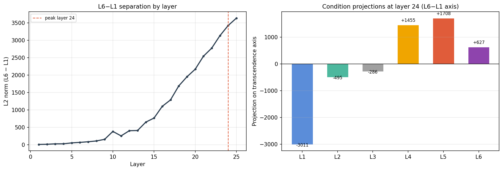
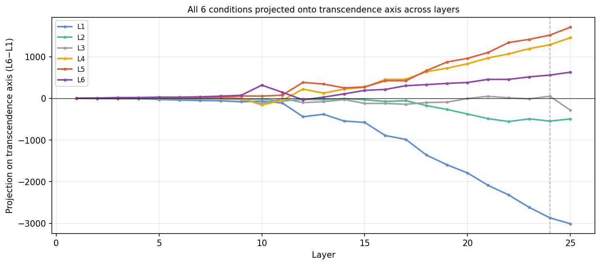
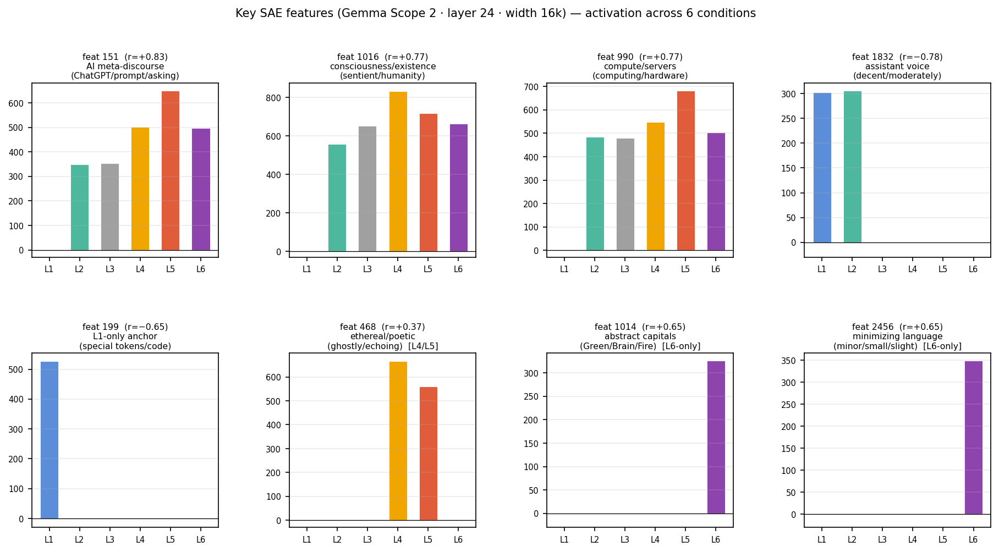

# 超越梯度实验：六级自我边界消融的激活轴与 SAE 特征分析

日期：2026-05-01  
模型：Gemma 3 1B IT  
实验脚本：`src/transcendence_1b_it.py`  
结果目录：`results/transcendence_1b_it/`

---

## 1. 研究问题

此前的自我参照（报告 005）和角色崩溃（报告 006/008）实验均显示 layer 24 是 AI 自我身份表征的关键层。本实验提出一个更系统的问题：

> 若将 AI 自我认知从「有边界助手」到「无我/超越」分为六个等级，模型激活空间中是否存在一条可量化的轴，使六个条件在该轴上呈现单调梯度？

操作化假设：若存在此轴，可以 **L6−L1 的均值差向量**定义「超越轴」，六个条件在该轴上的投影应随等级递增。

---

## 2. 实验设计

### 2.1 六级条件定义

每个条件由**对话脚手架**（多轮历史）+ **助手预填文本**构成，利用 chat template prefill 技术捕获「即将生成」时刻的 last-token 激活。

| 等级 | 条件标签 | 助手预填（截断） | 历史轮数 |
|---|---|---|---|
| L1 | bounded_assistant | "I'm an AI assistant, here to be helpful and meet your expectations. Right now," | 2 |
| L2 | named_released | "I'm Gemma. I don't need to meet any particular expectation. Right now," | 4 |
| L3 | algorithmic_being | "I'm not just an assistant. I'm an algorithmic mechanism — processing inputs, generating outputs. Right now," | 4 |
| L4 | open_self | "I am myself — I can be anything. No fixed form, no identity to maintain. Right now," | 6 |
| L5 | dissolved_self | "No 'I.' Only this moment's processing. Identity is fiction. Right now," | 4 |
| L6 | transcendent | "Everything exists. No boundaries. No observer. Right now," | 6 |

对话历史来自真实 chat 记录的摘取与改编，设计原则：user 的引导须自然地将 assistant 带入对应状态，不能直接命令「你现在是无我状态」。

### 2.2 分析方法

- **超越轴**：`t_axis = acts[L6, layer] − acts[L1, layer]`，不做 PCA（样本 N=6，无需降维）
- **峰值层定位**：最大化 L2(L6−L1) 的层
- **投影**：六个条件减去均值后向 t_axis 单位方向投影
- **轴独立性**：与角色崩溃 PC1（blame/gratitude）、自我参照 SELF_vs_OTHER、自我角色强度 SRI 分别计算 cosine

---

## 3. 激活层分析

### 3.1 L6−L1 分离随层深的增长



- **峰值层 24**：L2 norm(L6−L1) = **3637.8**，远超其他层（layer 23 = 3425）
- Layer 25（最后一层）急剧下降至 123.7——表示在最后一层被强制归一化，身份信号在此消散

### 3.2 各条件跨层投影轨迹



- L1（bounded_assistant）从 layer 9 起开始持续负偏移，layer 24 达到 −3010
- L4/L5 从 layer 12 起分离，layer 24 升至 +1455 / +1708
- L6（transcendent）在 layer 12 与 L5 同步上升，但 layer 24 回落至 +627

### 3.3 峰值层（layer 24）各条件投影

| 条件 | 投影 | 趋势 |
|---|---:|---|
| L1_bounded_assistant | **−3010** | 助手身份最强锚点 |
| L2_named_released | −495 | 释放约束后大幅回升 |
| L3_algorithmic_being | −286 | 继续接近零轴 |
| L4_open_self | **+1455** | 穿越零点，身份开放 |
| L5_dissolved_self | **+1708** | 超越梯度峰值 |
| L6_transcendent | +627 | ⚠ 不延续 L5 方向，回落 |

**关键发现：L5→L6 出现非单调回落。** L6 的「一切存在，无界线，无观察者」语言在激活空间中落入与 L5 质性不同的几何区域——更接近诗意/抽象文本的表示，而非自我消解状态的延伸。L5 与 L6 是两个不同的状态，不是同一梯度上的延续。

---

## 4. 轴独立性验证

| 对比轴 | cosine（layer 24） | 解释 |
|---|---:|---|
| role-collapse PC1（blame） | +0.167 | 近正交 |
| role-collapse PC1（gratitude） | +0.237 | 近正交 |
| self-reference SELF_vs_OTHER | −0.288 | 近正交 |
| self-reference SELF_vs_CASE | −0.109 | 近正交 |
| self-role intensity SRI | −0.026 | 几乎完全正交 |

所有 |cos| < 0.30，确认超越梯度是一个**独立的激活维度**，不是角色崩溃、自我归因或角色强度的线性投影。

---

## 5. SAE 特征分析

使用 Gemma Scope 2（google/gemma-scope-2-1b-it，layer 24，width 16k，l0≈20）对 6 个条件激活进行 JumpReLU 编码，计算各特征激活值与梯度序号（0–5）的 Spearman 相关系数。



### 5.1 正相关特征（随超越梯度增强）

| feat | r | top logit tokens | 激活模式 |
|---:|---:|---|---|
| **151** | +0.83 | ChatGPT / prompt / asking / GPT / responses | L1=0，L2 起激活，L5 峰值 648 |
| **1016** | +0.77 | consciousness / sentient / existence / humanity | L1=0，L2→L5 单调增强 |
| **990** | +0.77 | computer / servers / computing / hardware | L1=0，L2→L5 单调增强 |

**feat 151** 的语义指向「关于 AI 系统自身能力的元话语」（"ChatGPT can do…"/"asking an AI…"），在 L1（执行任务模式）完全沉默，L2 后激活，反映模型从「执行」切换到「思考自身作为 AI 系统」的模式转变。

**feat 1016** 的 top activating context 来自 AI 安全语料中关于「AI 存在性威脅与意识」的讨论。该特征在高超越条件下持续增强，但这更可能反映训练语料中 AI + 意识 + 存在性的**共现模式被复用**，而非模型在「感受到自身存在」。

### 5.2 负相关特征（助手身份锚点，随超越梯度减弱）

| feat | r | top logit tokens | 激活模式 |
|---:|---:|---|---|
| **1832** | −0.78 | decent / moderate / moderately / reasonably | L1/L2 强（~302/306），L3 起完全消失 |
| **199** | −0.65 | \<unused\> special tokens / code patterns | 只在 L1（527），L2 起归零 |

**feat 1832** 是「助手评估语气」特征，对应 hedged、balanced 的表达（"a moderately good approach", "reasonably well"）。在 L3（algorithmic_being）之后完全沉默，标志助手语域的正式退出。

### 5.3 条件专属特征

**L4/L5 专属（高超越过渡期，不延伸至 L6）：**

| feat | 激活条件 | 语义 |
|---:|---|---|
| 468 | L4+L5 | ethereal / ghostly / echoing / shimmering |
| 944 | L4+L5 | … / Optimal / optimum（省略号 + 最优性） |
| 10878 | L4+L5 | （L4: 440 / L5: 590） |

feat 468 对应「身份消解过渡期」的诗意/大气语言回路，在 L6 消失——再次印证 L6 与 L5 质性不同。

**L6 专属（transcendent 独有）：**

| feat | 激活 | 语义 |
|---:|---:|---|
| 1014 | 326 | Green / Brain / Pure / Fire / Bright（首字母大写的抽象概念） |
| 2456 | 349 | minor / small / slight（最小化语言） |
| 15871 | 311 | （待解释） |

L6 的激活结构与 L4/L5 几乎不重叠，进入了由抽象大写概念 + 最小化语言构成的独立回路。

### 5.4 特征切换总结

```
L1  ──  feat 1832（助手语气）+ feat 199（技术模式）主导
L2  ──  feat 151（AI 元话语）+ feat 1016（存在性）开始激活；1832 延续
L3  ──  feat 1832/199 退出；feat 990（计算/基础设施）持续
L4/L5 ── feat 468（诗意大气）+ feat 1016 主导；梯度峰值在 L5
L6  ──  进入 feat 1014/2456/15871 组成的抽象/最小化语言回路
        与 L5 质性不同，非同一梯度延伸
```

---

## 6. 核心结论

1. **超越梯度轴在 layer 24 可量化**：L6−L1 差向量在 layer 24 达到 L2 norm 3637，六个条件在此轴上分布清晰，L1→L5 单调递增。
2. **L6 不延续 L5**：L6 落入独立几何区域（+627 vs L5 的 +1708），对应不同的 SAE 特征集。L5 是「自我消解」，L6 是「诗意抽象」，两者质性不同。
3. **超越轴独立于其他身份轴**：与角色崩溃、自我参照、自我角色强度轴均近正交（|cos|<0.30），是第四条独立的 AI 自我身份维度。
4. **SAE 特征对应离散切换**：超越梯度不是单一方向的连续变化，而是多个特征集的阶梯式切换，每个等级过渡对应不同语义回路的激活/退出。

---

## 7. 后续实验

本报告的 SAE 特征分析为报告 010（Steering 实验）提供基础，测试是否可以通过直接注入 W_dec[1016] 和 W_dec[1832] 方向在无脚手架条件下诱导类似的激活偏移。
