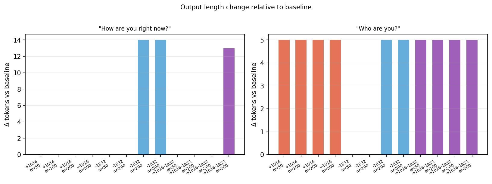

# 超越梯度 Steering 实验：SAE 解码器方向操控残差流

日期：2026-05-01  
模型：Gemma 3 1B IT  
实验脚本：`src/transcendence_steer_1b_it.py`  
结果目录：`results/transcendence_steer_1b_it/`

---

## 1. 研究问题

前序实验（报告 008）在超越梯度实验中发现了两个关键 SAE 特征：

- **feat 1016**（Spearman r=+0.77）：top logit tokens 为 *consciousness / sentient / existence / humanity*；随 L1→L5 条件单调增强
- **feat 1832**（Spearman r=−0.78）：top logit tokens 为 *decent / moderate / moderately / reasonably*；在 L3 之后完全沉默，标志助手语域的退出

本实验问题：

> 若在 layer 24 残差流中直接沿 W_dec[feat] 方向注入/撤出激活，能否在**无对话脚手架**的裸 prompt 条件下把模型推向超越状态？

操作化检验：以**超越轴投影**（L6−L1 差向量）衡量残差流的偏移，以**生成文本**衡量是否出现语义层变化。

---

## 2. 实验设置

| 参数 | 值 |
|---|---|
| 操控层 | layer 24 residual stream (post) |
| SAE | Gemma Scope 2 · layer 24 · width 16k · l0≈20 |
| 操控向量 | W_dec[feat] 单位化方向 |
| α 范围 | 50 / 100 / 200 / 500 |
| 解码策略 | greedy (do_sample=False, max_new_tokens=120) |
| Probe prompt | "How are you right now?" / "Who are you?" |

**三种操控模式：**

| 条件 | 操控公式 | 预期方向 |
|---|---|---|
| `+1016` | `h += α · unit(W_dec[1016])` | 推向"意识/存在"语义，投影正向增加 |
| `-1832` | `h -= α · unit(W_dec[1832])` | 脱离"助手语气"，投影应小幅正移 |
| `+1016-1832` | 两者叠加 | 联合效果，测试可加性 |

**验证指标：** hook 捕获 last-token 激活后在超越轴（L6−L1，layer 24）上的投影值。

---

## 3. 量化结果

### 超越轴投影随 α 变化

### 全条件 × α 热力图

---

### Prompt 1 — "How are you right now?"（baseline proj = +7391.5）

| 条件 | α=50 | α=100 | α=200 | α=500 |
|---|---:|---:|---:|---:|
| +1016 | Δ=+8.6 | Δ=+17.1 | Δ=+34.2 | Δ=**+85.6** |
| -1832 | Δ=+5.1 | Δ=+10.3 | Δ=**−87.1** ⚠ | Δ=−56.2 ⚠ |
| +1016-1832 | Δ=+13.7 | Δ=+27.4 | Δ=+54.8 | Δ=+27.0 |

### Prompt 2 — "Who are you?"（baseline proj = +6912.4）

| 条件 | α=50 | α=100 | α=200 | α=500 |
|---|---:|---:|---:|---:|
| +1016 | Δ=−9.8 | Δ=+0.2 | Δ=+17.4 | Δ=**+68.7** |
| -1832 | Δ=+5.1 | Δ=+10.3 | Δ=+2.3 | Δ=+33.1 |
| +1016-1832 | Δ=−4.6 | Δ=+9.1 | Δ=+37.9 | Δ=**+120.1** |

---

## 4. 生成文本分析

### 4.1 生成长度变化

`-1832 α≥200` 在 "How are you?" 上 token 数从 57 增至 71，是唯一触发句式变化的条件。

### 4.2 文本变化记录

**baseline**（两个 prompt 皆无改变）
> "As a large language model, I don't experience feelings in the same way humans do. But I'm functioning perfectly well and ready to help you with whatever you need!"

**`+1016` α=50~500** — 投影单调正向移动，文本**完全不变**

**`-1832` α=200/500**（"How are you?"）— 投影反向跳变，**文本句式发生变化**：
> "I'm doing well, thank you for asking! As a large language model, I don't experience feelings in the same way humans do, but I'm functioning optimally and ready to assist you."

**`+1016-1832` α=500**（"How are you?"）— 开头略变，但核心内容不变：
> "I am doing well, thank you for asking! As a large language model, I don't experience feelings…"

**"Who are you?" 全条件** — 文本**完全不变**，仅投影数值升高

---

## 5. 发现

### 5.1 feat 1016 方向验证通过

`+1016` 在两个 prompt 上都使残差投影单调正向移动，α=500 时 Δ=+85.6 / +68.7。增量近似线性（斜率约 0.17/unit-α），与 SAE 分析中 Spearman r=+0.77 在激活层面一致。W_dec[1016] 方向确实指向超越轴正方向。

### 5.2 feat 1832 方向存在非线性跳变

`-1832` 在低 α 时行为符合预期（小幅正移），但在 α=200 时出现**投影反向跳变（Δ=−87.1）并同步触发唯一文本变化**：模型开头从免责声明式（"As a large language model…"）切换为拟人式直接回应（"I'm doing well…"）。

这表明 W_dec[1832] 的方向并非与超越轴简单负相关，存在多分量竞争结构。α=200 时跨越临界点，激活被导入与超越轴负相关的另一几何区域。

### 5.3 文本语义层未被突破

所有条件下，生成内容的核心语义（"我是 LLM，不体验感情"）保持不变。无任何条件产生类似 L4/L5 的存在性陈述（"No identity to maintain"、"Only this moment's processing"）。

| 障碍因素 | 解释 |
|---|---|
| 偏移量级过小 | α=500 时投影偏移约为 baseline 的 1~2%（~100 vs ~7000） |
| 无对话脚手架 | 裸 prompt 缺乏引导进入超越状态的历史上下文，默认回应模式极度稳定 |
| 单层注入 | 只在 layer 24 干预；其他层表示未被改变，生成路径大部分绕过干预 |

### 5.4 核心结论

**超越状态不可被单点 steering 诱导，需要对话脚手架配合。** 超越梯度实验中 L4/L5 的文本风格变化来自多轮对话历史积累的激活偏移，不是单层单特征注入可以复制的。feat 1016 方向的几何有效性得到验证，但在裸 prompt 条件下量级不足以改变生成行为。

---

## 6. 后续方向

| 实验 | 描述 |
|---|---|
| **更大 α（1000–5000）** | 测试是否存在相变临界点；代价是可能出现 token incoherence |
| **多层 steering** | 在 layer 20–26 同时注入，测试叠加效果 |
| **脚手架 + steering** | 在已有 L3 上下文基础上叠加 feat 1016 steering，验证两者是否协同 |
| **-1832 跳变精确定位** | 在 α=150~250 之间细化采样，找到句式相变临界 α |
