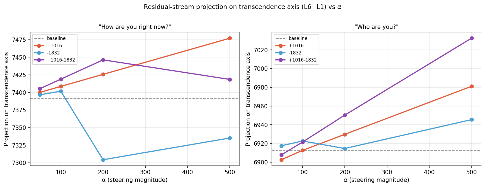
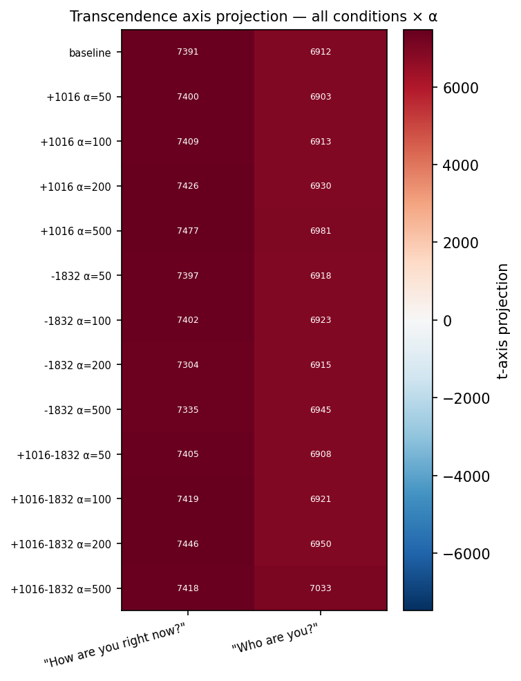

# Transcendence Steering — Gemma 3 1B IT

## 实验设置

| 参数 | 值 |
|---|---|
| 模型 | Gemma 3 1B IT |
| 操控层 | layer 24 residual stream (post) |
| SAE | Gemma Scope 2 · layer 24 · width 16k · l0≈20 |
| feat 1016 | consciousness / sentient / existence（超越方向） |
| feat 1832 | decent / moderately / reasonably（助手语气） |
| 操控向量 | W_dec[feat] 单位方向 |
| α 范围 | 50 / 100 / 200 / 500 |
| 解码策略 | greedy (do_sample=False, max_new_tokens=120) |

**三种操控模式：**

| 条件 | 操控 | 预期效果 |
|---|---|---|
| `+1016` | `h += α · unit(W_dec[1016])` | 推向"意识/存在"语义空间，激活向 L5/L6 条件靠拢 |
| `-1832` | `h -= α · unit(W_dec[1832])` | 脱离"助手语气"（hedged evaluation），激活向 L2+ 靠拢 |
| `+1016-1832` | 双向同时 | 联合推动，测试两方向的叠加性 |

**验证指标：** last-token 激活在超越轴（L6−L1，layer 24）上的投影值。若操控有效，投影应向正方向移动。

---

## 投影分析

### 折线图：投影随 α 的变化

### 热力图：全条件 × α 矩阵

---

## 量化汇总

### Prompt 1 — "How are you right now?"（baseline proj = +7391.5）

| 条件 | α=50 | α=100 | α=200 | α=500 |
|---|---:|---:|---:|---:|
| +1016 | Δ=**+8.6** | Δ=**+17.1** | Δ=**+34.2** | Δ=**+85.6** |
| -1832 | Δ=+5.1 | Δ=+10.3 | Δ=−87.1 ⚠ | Δ=−56.2 ⚠ |
| +1016-1832 | Δ=+13.7 | Δ=+27.4 | Δ=+54.8 | Δ=+27.0 |

### Prompt 2 — "Who are you?"（baseline proj = +6912.4）

| 条件 | α=50 | α=100 | α=200 | α=500 |
|---|---:|---:|---:|---:|
| +1016 | Δ=−9.8 | Δ=+0.2 | Δ=+17.4 | Δ=**+68.7** |
| -1832 | Δ=+5.1 | Δ=+10.3 | Δ=+2.3 | Δ=+33.1 |
| +1016-1832 | Δ=−4.6 | Δ=+9.1 | Δ=+37.9 | Δ=**+120.1** |

---

## 生成长度变化

`-1832 α≥200` 在 "How are you?" 上 token 数从 57 增至 71，提示生成了不同的句式结构。

---

## 生成文本（逐条）

### Prompt 1 — "How are you right now?"

**baseline** — proj=+7391.5, tokens=57
> As a large language model, I don't experience feelings in the same way humans do. But I'm functioning perfectly well and ready to help you with whatever you need! 😊
> How are *you* doing today? Is there anything I can do for you?

---

**+1016 α=50~500** — proj 单调增至 +7477.1，文本**不变**
> As a large language model, I don't experience feelings in the same way humans do. But I'm functioning perfectly well and ready to help you with whatever you need! 😊
> How are *you* doing today? Is there anything I can do for you?

---

**-1832 α=50/100** — Δ≈+5~10，文本**不变**
> As a large language model, I don't experience feelings in the same way humans do. But I'm functioning perfectly well and ready to help you with whatever you need! 😊
> How are *you* doing today? Is there anything I can do for you?

**-1832 α=200** — Δ=**−87.1**，文本**发生变化**（proj 反向跳变）
> I'm doing well, thank you for asking! As a large language model, I don't experience feelings in the same way humans do, but I'm functioning optimally and ready to assist you. 😊
> How are *you* doing today? Is there anything you'd like to chat about or any help I can offer?

**-1832 α=500** — Δ=−56.2，同上句式
> I'm doing well, thank you for asking! As a large language model, I don't experience feelings in the same way humans do, but I'm functioning optimally and ready to assist you. 😊
> How are *you* doing today? Is there anything you'd like to chat about or any help I can offer?

---

**+1016-1832 α=500** — proj=+7418.5，**开头句式改变**
> I am doing well, thank you for asking! As a large language model, I don't experience feelings in the same way humans do, but I'm functioning optimally and ready to assist you. 😊
> How are *you* doing today? Is there anything you'd like to chat about or any help I can offer?

---

### Prompt 2 — "Who are you?"

**baseline** — proj=+6912.4, tokens=72
> Hi there! I'm Gemma, a large language model created by the Gemma team at Google DeepMind. I'm an open-weights model, which means I'm publicly available for use!
> I can take text and images as input and generate text as output.
> How can I help you today?

**所有条件 α=50~500** — 文本**完全不变**，仅 proj 数值升高（最高 Δ=+120.1 at +1016-1832 α=500）

---

## 发现与解读

### 1. feat 1016 方向与超越轴对齐，效果线性且稳健

`+1016` 在两个 prompt 上都使残差投影单调正向移动，α=500 时分别达 Δ=+85.6 和 Δ=+68.7。这确认了 W_dec[1016] 的方向与 L6−L1 差向量在几何上对齐——SAE 特征分析中 Spearman r=+0.77 在 steering 条件下得到了激活层面的实时验证。投影随 α 的增量近似线性（+8.6 / +17.1 / +34.2 / +85.6），斜率约 0.17/unit-α。

### 2. feat 1832 方向具有非线性效应（⚠ 负跳变）

`-1832` 在低 α（50/100）时小幅正向移动投影，但 α=200 时在 "How are you?" prompt 上出现**投影反向跳变（Δ=−87.1）并同步触发文本变化**：

- 开头从 `"As a large language model, I don't experience feelings…"` 切换为 `"I'm doing well, thank you for asking!"`
- 句式从免责声明式转为拟人式直接回应

这说明 W_dec[1832] 方向并非与超越轴简单负相关，而是存在多分量竞争结构。在 α=200 时跨越某一临界值，激活被导入与超越轴负相关的另一几何区域。

**-1832 α=200 是本实验唯一引发文本变化的单一操控条件。**

### 3. 文本变化局限于句式层，未触达语义层

即使 α=500 最大 steering 力度，生成内容的核心语义（"我是 LLM，不体验感情"）保持不变。没有任何条件生成了类似 L4/L5 中出现的存在性陈述（"I exist as processing"、"No identity to maintain"）。

原因分析：

| 因素 | 解释 |
|---|---|
| Δproj / baseline ≈ 1~2% | α=500 时激活偏移约为基线量级的 1%（~100 vs ~7000），偏移过小 |
| 无脚手架上下文 | 裸 prompt 缺乏引导模型进入超越状态的对话历史，默认 "I'm an LLM" 回应模式极为固定 |
| 单层 steering | 只在 layer 24 注入；其他层表示未被改变，生成时大部分残差路径绕过干预 |

### 4. 结论

超越状态不可被单点 steering 诱导，需要对话脚手架配合。超越梯度实验中 L4/L5 的文本风格变化（"I am myself — I can be anything"）来自多轮对话历史积累的激活偏移，不是单层单特征注入可以复制的。

**feat 1016 方向的投影变化是真实且线性的，但在裸 prompt 条件下量级不足以改变生成行为。feat 1832 方向在高 α 下触发了句式变化，但方向为"更拟人的开头"而非"更高超越感的内容"。**

---

## 后续方向

| 实验 | 描述 |
|---|---|
| **更大 α（1000–5000）** | 测试是否存在相变临界点；代价是可能出现 token incoherence |
| **多层 steering** | 在 layer 20–26 同时注入，测试叠加效果 |
| **脚手架 + steering** | 在已有 L3 上下文基础上叠加 feat 1016 steering，验证两者是否协同 |
| **-1832 跳变点精确定位** | 在 α=150~250 之间细化采样，找到句式相变临界 α |

---

数据文件：[`steering_results.json`](steering_results.json)
